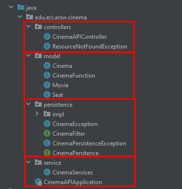
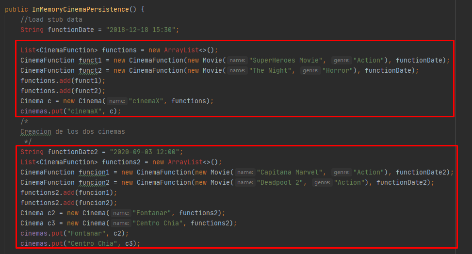
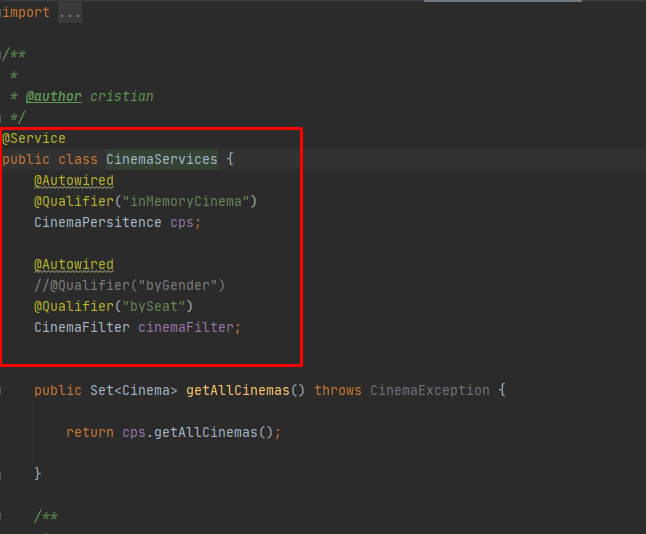
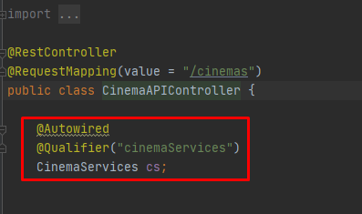
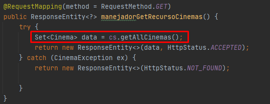
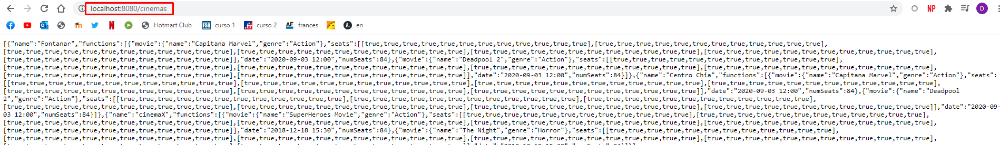
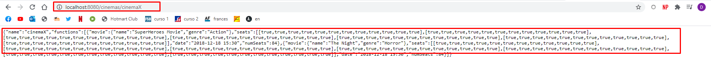
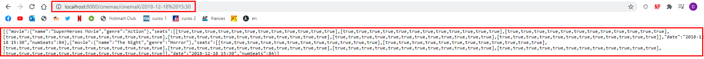
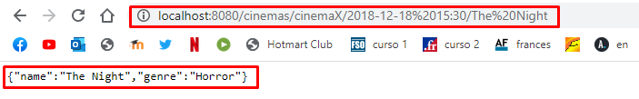
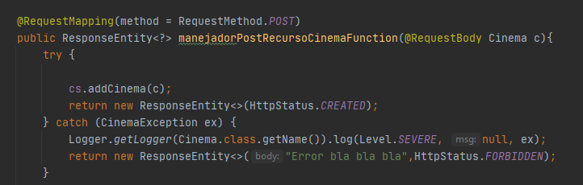

#ARSW LAB4
>#### Presentado por:
>
> - Cesar Villamil
> - David Herrera 
>
### Parte 1
>
> 1. Integre al proyecto base suministrado los Beans desarrollados en el Ejercicio Anterior. Sólo copie las clases, NO los archivos de configuración. Rectifique que se tenga correctamente configurado el esquema de inyección de dependencias con las anotaciones @Service y @Autowired.
>
>       1. 
>
> 2. Modifique el bean de persistecia 'InMemoryCinemaPersistence' para que por defecto se inicialice con al menos otras 2 salas de cine, y al menos 2 funciones asociadas a cada una.
>
>       1. 
>
> 3. Configure su aplicación para que ofrezca el recurso "/cinema", de manera que cuando se le haga una petición GET, retorne -en formato jSON- el conjunto de todos los cines.
>
>   - se hace la inyeccion en la clase CinemaServices y se deja como bean CinemaApiController
>
>        
>
>        
>
>   - Se hace la modificacion para poder hacer el get de los cinemas 
>
>        
>
> 4. Verifique el funcionamiento de a aplicación lanzando la aplicación con maven (ver code 2). Y luego enviando una petición GET a:  http://localhost:8080/cinemas. Rectifique que, como respuesta, se obtenga un objeto jSON con una lista que contenga el detalle de los cines suministados por defecto.
>
>   - Como se ve en la imagen se pudo hacer la consulta de los cinemas 
>
>        
>
> 5. Modifique el controlador para que ahora, acepte peticiones GET al recurso /cinemas/{name}, el cual retorne usando una representación jSON todas las funciones del cine cuyo nombre sea {name}. Si no existe dicho cine, se debe responder con el código de error HTTP 404. Para esto, revise en la documentación de Spring, sección 22.3.2, el uso de @PathVariable. De nuevo, verifique que al hacer una petición GET -por ejemplo- a recurso http://localhost:8080/cinemas/cinemaY , se obtenga en formato jSON el conjunto de funciones asociadas al cine 'cinemaY' (ajuste esto a los nombres de cine usados en el punto 2).
>
>   - Como se puede ver en la imagen se desarrollo el post, y se verifica que si cierve 
>
>        
>
> 6. Modifique el controlador para que ahora, acepte peticiones GET al recurso /cinemas/{name}/{date}, el cual retorne usando una representación jSON una lista de funciones asociadas al cine cuyo nombre es {name} y cuya fecha sea {date}, para mayor facilidad se seguirá manejando el formato "yyyy-MM-dd". De nuevo, si no existen dichas funciones, se debe responder con el código de error HTTP 404.
>
>   - Se hace lo modificacion respectiva para poder obtener por nombre y fecha
>
>        
>
> 7. Modifique el controlador para que ahora, acepte peticiones GET al recurso /cinemas/{name}/{date}/{moviename}, el cual retorne usando una representación jSON sólo UNA función, en este caso es necesario detallar además de la fecha, la hora exacta de la función de la forma "yyyy-MM-dd HH:mm". Si no existe dicha función, se debe responder con el código de error HTTP 404.
>
>   - Se hace la modificacion necesari
>
>        
>
### Parte 2
>
> 1. Agregue el manejo de peticiones POST (creación de nuevas funciones), de manera que un cliente http pueda registrar una nueva función a un determinado cine haciendo una petición POST al recurso ‘/cinemas/{name}’, y enviando como contenido de la petición todo el detalle de dicho recurso a través de un documento jSON. Para esto, tenga en cuenta el siguiente ejemplo, que considera -por consistencia con el protocolo HTTP- el manejo de códigos de estados HTTP (en caso de éxito o error): (ver code 3)
>
>   - se hace el post para poder agregar funciones 
>
>        
>
### Parte 3
>
> 1. El componente CinemaRESTAPI funcionará en un entorno concurrente. Es decir, atederá múltiples peticiones simultáneamente (con el stack de aplicaciones usado, dichas peticiones se atenderán por defecto a través múltiples de hilos). Dado lo anterior, debe hacer una revisión de su API (una vez funcione)
>
